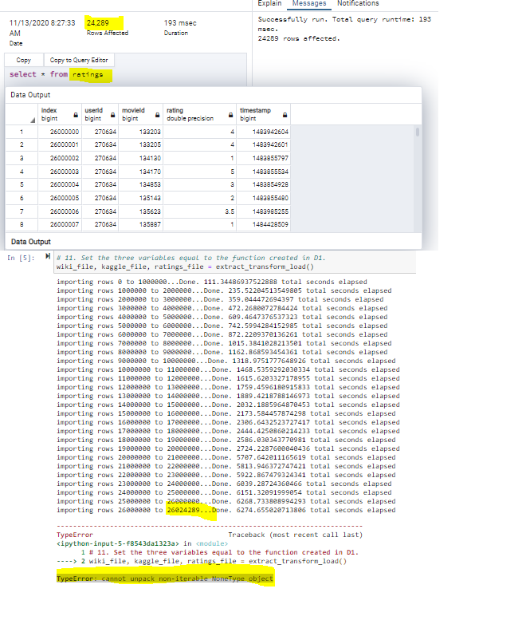

# Movies-ETL Challenge
##### VDAB Module 8 Extract-Transform-Load
Sandra Whitley | Nov 2020
****************************

## Overview
The purpose of the Movies-ETL Challenge was use Python and Pandas to create a extract_transform_load() function to extract data from an api call (wikipedia-movies.json) and 2 csv files (Kaggle movie_metadata.csv and MovieLens ratings.csv) transform the files by cleaning and standardizing the data in order to merge them into a movies dataframe and then load the data into a SQL datasbase called movies_sql db. 

## Process Summary
The first stage of the process was to read the json file and 2 csv files into 3 separate pandas dataframes.   
  See Deliverable 1.

The second stage was to clean the wiki_movies dataframe to prepare it for merging with the Kaggle movie_metadata dataframe. The cleaned wiki_movies dataframe became the movies_df dataframe.  
  See Deliverable 2.

The third stage merged the Kaggle metadata dataframe with the movies_df dataframe and then cleaned the data by eliminating unncecessary columns, filling in missing data and renaming columns. This new dataframe became the movies_df dataframe. The MovieLens ratings dwas also cleaned and transformed in preparation for loading in the SQL database.  
  See Deliverable 3.

The last stage of this process was to load the movies_df dataframe and ratings data into the SQL database as the movies table and the ratings table, respectively. At the end of the code sequence, the results showed 26024289 rows importing into the SQL ratings table but this was followed by a "TypeError: cannot unpack non-iterable NoneType object" error. Upon querying the SQL database to evaluate the output, the movies table included 6052 rows and the ratings table included 24289 rows. The ratings data discrepancy was not understood and therefore not resolved.  
  See Deliverable 4, 5, 6.

#### Deliverables
1. [ETL_function_test.ipynb script](ETL_function_test.ipynb)

2. [ETL_wiki_movies.ipynb script](ETL_wiki_movies.ipynb)

3. [ETL_kaggle_data.ipynb script](ETL_kaggle_data.ipynb)

4. [ETL_create_database.ipynb script](ETL_create_database.ipynb)

5. Movies_query Output

6. Ratings_query Output

